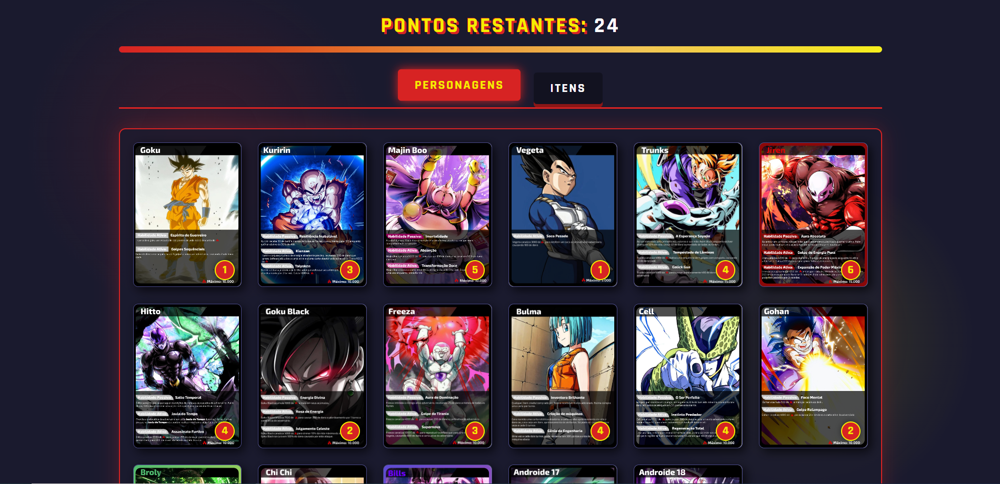
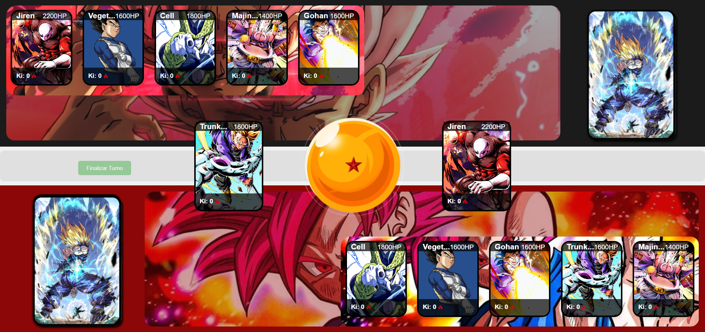
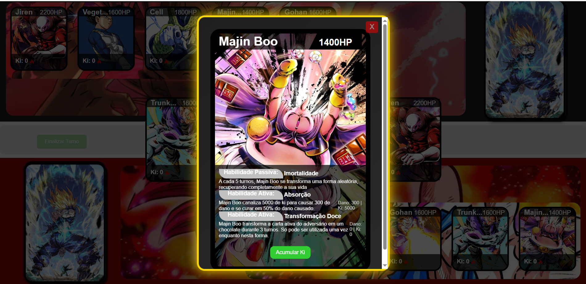

# DBZ Card Game
---
Este repositório contém um jogo de cartas online baseado em "Pokemon TCG" com inspiração em personagens de "Dragon Ball". Construído permite jogabilidade e interação em tempo real através do **microframework Flask**

# Demonstração Visual

Tecnologias Utilizadas: HTML, CSS, Javascript, Python/SocketIO

Link da Aplicação: https://dbz-card-game.onrender.com

OBSERVAÇÃO 07/08/25 - Jogo funciona corretamente localmente e com ngrok, porém, ainda tem problemas no funcionamento no render. Em correção.
